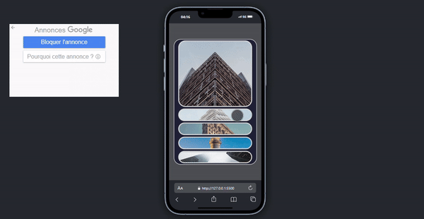

# Image Gallery Project

This project is an **image gallery** application built using **HTML** and **CSS**. The gallery is designed to be **responsive** and works well on different screen sizes.

## Demo

## Features

- 5 different images are arranged in box-shaped containers.
- When clicked, the images' sizes change, and their border style becomes active.
- A transition effect is applied for user interaction.
- The design is **responsive**, optimized for mobile devices.

## Project Structure

The project has the following file structure:

- **index.html**: The main page file where the image gallery is located.
- **style.css**: The stylesheet for the gallery. Design and responsiveness settings are handled here.
